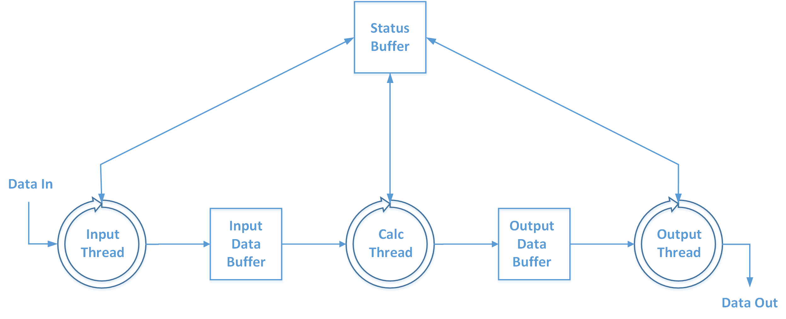

## About HASHPIPE

* What is HASHPIPE ?

HASHPIPE is High Availibility Shared Pipeline Engine. 
Hashpipe is code usually used to move data through an X engine running on a CPU and GPU. It handles collecting packets from multiple F engines through a NIC (Network Interface Card), re-ordering the data and converting it to a type appropriate for processing on the Graphics Card. It then sends data from the system RAM to the GPU RAM and calls the xGPU code which performs the X operation on the inputs provided. After correlation hashpipe copies the output of the CUDA X-engine (xGPU), reorders/re-interprets the data and sends the data to a catcher machine which handles further accumulation, data aggregation and save the data to disc.

The Hashpipe code is a derivative of GUPPI, this software developed by NRAO (National Radio Astronomy Observatory) for FPGA/GPU pulsar instrumentation. It was then modified/adapted by
UC Berkeley for the Green Bank VEGAS multibeam spectrometer. Most recently it has been further modified/adapted by David Macmahon from UC Berkeley for use in FPGA/GPU correlators under the name of HASHPIPE.

* Installation of HASHPIPE
	* You can download it [from here](http://astro.berkeley.edu/~davidm/hashpipe.git). Or you can use this command: 
      ```javascript
      git clone http://astro.berkeley.edu/~davidm/hashpipe.git 
      ```
    	This code wrote by David Macmahon from UC Berkeley.
	* To build HASHPIPE from a freshly cloned repository you need to have autoconf anf automake and libtool installed. Once those are in place, you can run the following commands to build HASHPIPE:
		```javascript
        $ cd src
        $ autoreconf -is
        $ ./configure
        $ make
        $ sudo make install
		```
      Instead of "sudo make install", you can also run "make staging", which will perform a local install to a directory named "staging" under the "src" subdirectory.
* Installation of rb-hashpipe
	* rb-hashpipe is a ruby code wrote by David Macmahon, which can monitor the status of packets receiving, CPUs/GPUs running and storage. You can download it [from here](https://github.com/david-macmahon/rb-hashpipe.git). You can use following steps to install.
	``` javascript
	### download rb-hashpipe
	git clone https://github.com/david-macmahon/rb-hashpipe.git
	### install rvm from https://rvm.io/rvm/install
	gpg --keyserver hkp://keys.gnupg.net --recv-keys 409B6B1796C275462A1703113804BB82D39DC0E3
	\curl -sSL https://get.rvm.io | bash
	\curl -sSL https://get.rvm.io | bash -s stable --ruby
	source ~/.rvm/scripts/rvm
	rvm list known
	rvm install 2.1.10
	rvm use 2.1.10 --default
	gem install curses
	gem install dev
	gem install bundle
	cd rb-hashpipe
	rake gem
	gem install pkg/***.gem
	```
There is a installation memo wrote by Peter Niu you can find it [in here](https://github.com/SparkePei/demo1_hashpipe/blob/master/hashpipe_install.pdf).
	
## demo1_hashpipe
This is a very basic introduction about how to use HASHPIPE.<br>
In this demo, you will know how does hashpipe works and how can you write your own code for your application. For easy understand how hashpipe works, demo1 shows a very simple job, which includes input two numbers from prompt, add them together, and write the result to a file. To do this, we defined 3 threads in this demo. demo1_net_thread collects the data from prompt and move them to an input data buffer. demo1_gpu_thread gets the data from input data buffer and add them together, and then put the result to an output data buffer. demo1_output_thread gets the data from output data buffer and write it to a file. 


> fig. 1 structure of demo1

Fig. 1 shows the structure of this demo.
For moving these data through different data buffers, you have to check the status of each thread all the time. Following is the detailed description.

* define data buffer
	
Before you write the threads code, you have to define the input and output data buffer in demo1_databuf.h like this:
```javascript
#define CACHE_ALIGNMENT         8
#define N_INPUT_BLOCKS          3 
#define N_OUTPUT_BLOCKS         3

typedef struct demo1_input_block {
   demo1_input_block_header_t header;
   demo1_input_header_cache_alignment padding; // Maintain cache alignment
   uint64_t number1;
   uint64_t number2;
} demo1_input_block_t;

typedef struct demo1_output_block {
   demo1_output_block_header_t header;
   demo1_output_header_cache_alignment padding; // Maintain cache alignment
   uint64_t sum;
} demo1_output_block_t;
```
The size of cache alignment should be the same with the size of the input data

we defined two uint64 variables for two numbers input, and one uint64 variable for sum result output.

* input thread

In demo1_net_thread.c, you can implement the input data buffer like this:
```javascript
demo1_input_databuf_t *db  = (demo1_input_databuf_t *)args->obuf;
```
To reduce the degree of difficulty, you just need input two numbers(a,b) from prompt instead of receiving packets through Ethernet. And then move these two numbers to the input data buffer you defined. 
```javascript	
printf("Please input first number:");
input=scanf("%d",&a);
printf("Please input second number:");
input=scanf("%d",&b);
db->block[block_idx].number1=a;
db->block[block_idx].number2=b;
```
Before you move them to input data buffer, you have to check the buffer whether free or not.
```javascript
while ((rv=demo1_input_databuf_wait_free(db, block_idx)) 
                != HASHPIPE_OK) {
            if (rv==HASHPIPE_TIMEOUT) {
                hashpipe_status_lock_safe(&st);
                hputs(st.buf, status_key, "blocked");
                hashpipe_status_unlock_safe(&st);
                continue;
            } else {
                hashpipe_error(__FUNCTION__, "error waiting for free databuf");
                pthread_exit(NULL);
                break;
            }
        }
```

You can display some run time data in rb-hashpipe monitor, you need define them like this:
```javascript
hputi8(st.buf,"A",a);
hputi8(st.buf,"B",b);
```
The most important thing is that you have to define a net threat under the type of hashpipe_thread_desc_t, give the following information: name,skey,init function(if no,tap NULL),run function,ibuf_desc(from prompt input or Ethernet,no in here), obuf_desc(to an input data buffer). See following code:
```javascript
static hashpipe_thread_desc_t demo1_net_thread = {
    name: "demo1_net_thread",
    skey: "NETSTAT",
    init: NULL,
    run:  run,
    ibuf_desc: {NULL},
    obuf_desc: {demo1_input_databuf_create}
};
```
	
* calculation thread

We defined demo1_gpu_thread in demo1_gpu_thread.c to get the two numbers from input shared memory, add them together, and then put the result to an output data buffer.
```javascript
//calculate c=a+b
a=db_in->block[curblock_in].number1;
b=db_in->block[curblock_in].number2;
c=a+b;
db_out->block[curblock_out].sum=c;
```
Before you get the data from input data buffer, you have to check the status of demo1_net_thread and wait until the input data buffer filled, you can do it like this:
```javascript
 while ((rv=demo1_input_databuf_wait_filled(db_in, curblock_in)) != HASHPIPE_OK) {
            if (rv==HASHPIPE_TIMEOUT) {
                hashpipe_status_lock_safe(&st);
                hputs(st.buf, status_key, "blocked");
                hashpipe_status_unlock_safe(&st);
                continue;
            } else {
                hashpipe_error(__FUNCTION__, "error waiting for filled databuf");
                pthread_exit(NULL);
                break;
            }
        }
```
After calculation, you have to check the output data buffer whether emputy or not, you need check the status like this:
```javascript
while ((rv=demo1_output_databuf_wait_free(db_out, curblock_out)) != HASHPIPE_OK) {
            if (rv==HASHPIPE_TIMEOUT) {
                hashpipe_status_lock_safe(&st);
                hputs(st.buf, status_key, "blocked gpu out");
                hashpipe_status_unlock_safe(&st);
                continue;
            } else {
                hashpipe_error(__FUNCTION__, "error waiting for free databuf");
                pthread_exit(NULL);
                break;
            }
        }
```
* output thread

In demo1_output_thread.c, we defined demo1_output_thread to get the data from output data buffer and then write it to file.You have to wait until the output data buffer filled.
```javascript
 while ((rv=demo1_output_databuf_wait_filled(db, block_idx))
                != HASHPIPE_OK) {
            if (rv==HASHPIPE_TIMEOUT) {
                hashpipe_status_lock_safe(&st);
                hputs(st.buf, status_key, "blocked");
                hashpipe_status_unlock_safe(&st);
                continue;
            } else {
                hashpipe_error(__FUNCTION__, "error waiting for filled databuf");
                pthread_exit(NULL);
                break;
            }
        }

```
Once you get the data out you need set the status of output data buffer to free.
```javascript
demo1_output_databuf_set_free(db,block_idx);
```

* Installation and running of demo1

	* To install demo1, you only need to tap make & sudo make install. 
	* To run demo, execute ./demo1_init.sh.
	* And then open another monitor window and tap hashpipe_status_monitor.rb to monitor it.

Fig. 2 shows how does demo1 looks like.

> Fig. 2 demo1's screen capture
